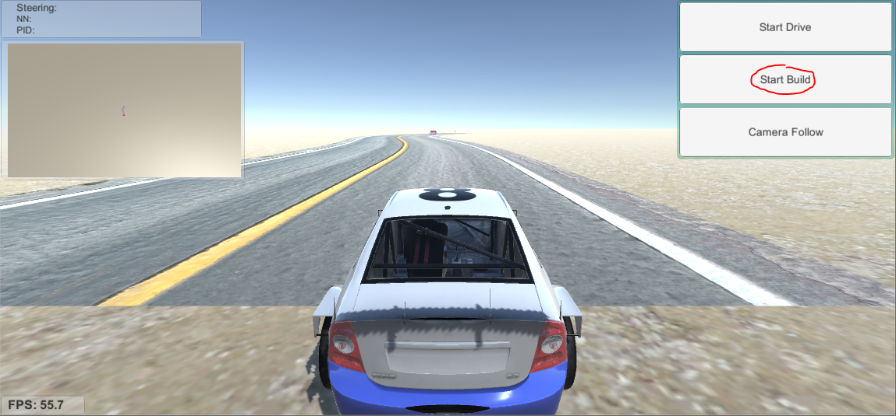
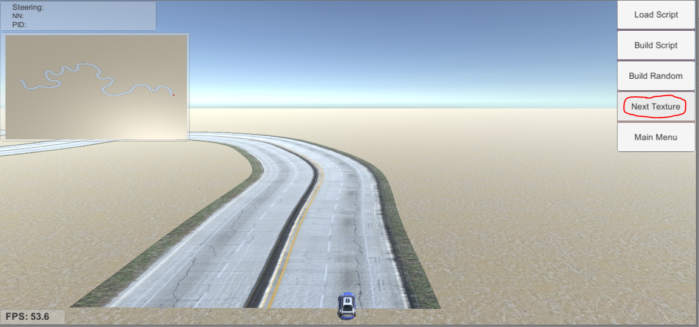
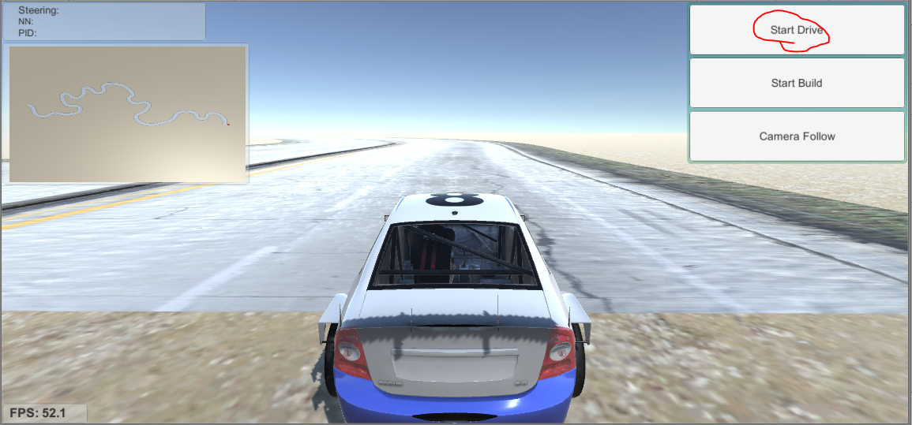
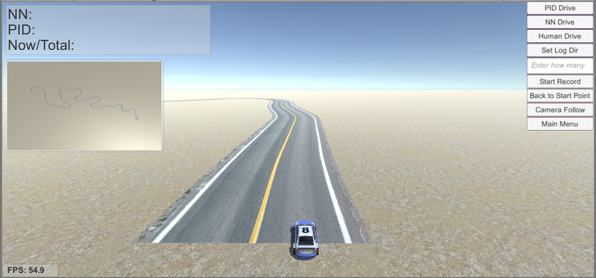

<!--
 * @Author: Sauron Wu
 * @GitHub: wutianze
 * @Email: 1369130123qq@gmail.com
 * @Date: 2019-09-23 10:12:28
 * @LastEditors  : Sauron Wu
 * @LastEditTime : 2020-01-16 17:57:33
 * @Description: 
 -->
# Introduction
The simulator we provided is based on the sdsandbox project. For more information about the initial project, please refer to [this](https://github.com/tawnkramer/sdsandbox). 

# What you can do with the simulator
- Collect training data
- Test your model or algorithms in the virtual world
- Build some exciting roads
- Play computer games only(not recommend)

## Setup

You need to have [Unity](https://unity3d.com/get-unity/download) installed, and python3+, tensorflow, keras is also needed.

You can both use linux version or windows version of Unity3d. 

## Using Unity3d to test your .h5 model

1) Start the prediction server with the pre-trained model. 

```bash
cd Virtual-Part
python src/predict_server.py --model=path-to-your-model/model.h5
```
 If you get a crash loading this model, you will not be able to run the demo. But you can still generate your own model. This is a problem between tensorflow/keras versions. 
 
2) Load the Unity project Virtual-Part/simulator in Unity. Double click on Assets/Scenes/main to open that scene.  

3) Hit the start button to launch. Then "Use NN Steering". 

## Build Your Own Road using Scripts
- S n
    This means to build straight road for n length.
- DY n
    This means the road will curve, the bigger n means bigger angle.
- L n
    This always follows DY, means build road with the pre-set angle by DY, and the road will turn left, n is the length, the direction degrees will change the value set by DY every step.
- R n
    Like L, this means to turn right.
- BLOCK n1 n2, CONE n1 n2
    This will add a block/cone in the road. n1 means how far it is from the road(>0 means moving to left, <0 means moving to right), n2 means the orientation of it.

## How to Play
### Camera Follow
You can hit `Camera Follow` button to choose whether to follow the car. If not, you can use your mouse's right button to change the angle of view, use the roller to see in different height, use the direction key to move your view.
### Open the project
1) Load the Unity project Virtual-Part/simulator in Unity.  
  

2) Hit the start arrow in Unity to launch project.  


### Build Road
1) Select `Start Build` to enter the build interface.


2) Use `Build Random` to generate a random road, use `Load Script` to open a redefined script and hit `Build Script` to build the script. Here is one example:


3) Hit `Next Texture` to change the road style.


### Control the Car
1) In the main menu, select `Start Drive` to start drive.


2) In the drive interface, the top 3 buttons means how to control the car. `PID Drive` means using PID algorithm to control the car; `NN Drive` means using neural network to control the car, in this mode you should start nn thread first; `Human Drive` means using your keyboard to control the car, `WASD` are used.
When you decide to collect some training data, you should hit `Set Log Dir` to choose the directory to store the data, then you can enter a number in `Enter how many` to set the max number of frames you want to collect, the record process will stop when reach max number, the default number is 50000. Hit `Start Record or Stop Record` to continue or stop the record process. I recommend that you start recording after starting the car. Also you can hit `Back to Start Point` button to move the car to the start point, this is useful if your road is not a circle.


## If you want to make some changes to the simulator, please read custom_simulator.md.


